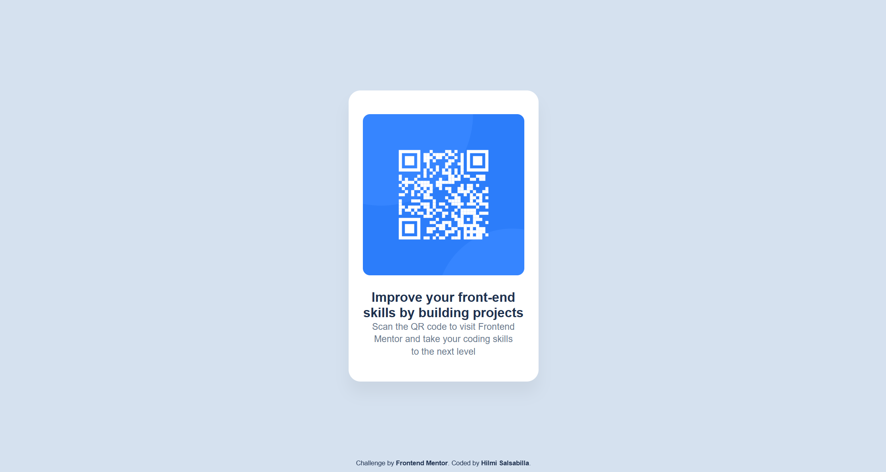

# Frontend Mentor - QR Code Component Solution

This is my solution to the [QR Code Component challenge](https://www.frontendmentor.io/challenges/qr-code-component-iux_sIO_H) on Frontend Mentor.  
The goal of this challenge is to practice basic layout skills using HTML and CSS.

## Table of contents

- [Overview](#overview)
  - [Screenshot](#screenshot)
  - [Links](#links)
- [My process](#my-process)
  - [Built with](#built-with)
  - [What I learned](#what-i-learned)
  - [Continued development](#continued-development)
  - [Useful resources](#useful-resources)
- [Author](#author)

---

## Overview

### Screenshot

Here is a preview of my finished project:



### Links

- **Solution URL:** <!-- Add your Frontend Mentor solution URL here -->
- **Live Site URL:** [GitHub Pages](https://hilmisalsabilla.github.io/qr-code-component/)

---

## My process

### Built with

- Semantic **HTML5** markup  
- **CSS Custom Properties**  
- **Flexbox** (for centering the layout)  
- **CSS Grid** (for structuring the card content)  
- Mobile-first workflow  

### What I learned

This project helped me reinforce the fundamentals:

- How to create a clean and semantic HTML structure
- How to use CSS variables to follow a design system
- Using Flexbox to center elements on a full viewport
- Using CSS Grid for simple component layout
- How spacing scales and typography tokens improve consistency

Example CSS I’m proud of:

```css
.card {
    background: #FFFFFF;
    width: 100%;
    max-width: 320px;
    border-radius: 20px;
    padding: 40px 24px;
    display: grid;
    gap: 24px;
    text-align: center;
    box-shadow: 0 20px 25px rgba(0, 0, 0, 0.05);
}
```

### Continued development

In future projects, I want to keep improving on:

- Structuring styles with reusable utility classes
- Responsive design and fluid spacing
- Accessibility (especially alt text and ARIA labels)
- Improving CSS architecture (BEM, components, tokens)

### Useful resources

- [MDN Web Docs](https://developer.mozilla.org/en-US/)
    - Always helpful for understanding HTML and CSS fundamentals.

- [CSS Grid Guide](https://css-tricks.com/snippets/css/complete-guide-grid/)
    - A great reference for CSS Grid layout.

- [Flexbox Guide](https://css-tricks.com/snippets/css/a-guide-to-flexbox/)
    - Helps visualize Flexbox behavior.

## Author
GitHub - [Hilmi Salsabilla](https://github.com/HilmiSalsabilla/)